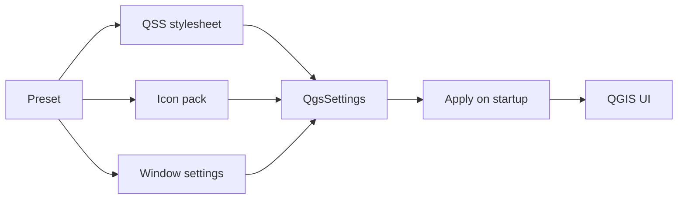

<div align="center">


# SkinKit

Complete QGIS UI customisation plugin. Successor to QSS Forge / Load-QSS.

[![License][license-badge]][license-url]
[![Last commit][commit-badge]][commits-url]
[![Issues][issues-badge]][issues-url]
[![Code size][size-badge]][repo-url]
[![Python][python-badge]][pyproject-url]
[![QGIS][qgis-badge]][qgis-url]
[![CI][ci-badge]][ci-url]
[![OpenSSF Scorecard][scorecard-badge]][scorecard-url]

</div>

## Features

| Feature | Details |
|---|---|
| **Theme Gallery** | One-click cards: Light, Dark, Minimalist, Dark Forest, Orange Forest, Wombat, Coffee, Dark green, Light green |
| **Stylesheet Editor** | Syntax-highlighted QSS editor with colour swatches, line numbers, brace/comment validation, auto-indent, save-to-file |
| **Live Reload** | `QFileSystemWatcher` auto-applies when you save the file externally (debounced 200 ms) |
| **Icon Pack per Preset** | Each preset stores its own icons/ folder; blank = QGIS default icons as reference baseline |
| **Background Image** | PNG/JPG on the main window: stretch, tile, center, fit modes (resize debounced 80 ms) |
| **Window Icon** | Override QGIS titlebar/taskbar icon per preset |
| **Toolbar Icon Size** | Slider 0-128 px via `QMainWindow.setIconSize()` |
| **Window Opacity** | Slider 10-100 % |
| **Font Override** | Family + point size |
| **Named Presets** | All settings stored together; QGIS Default always present |
| **Safe Reset** | Restores the QGIS built-in theme active before SkinKit was first used |
| **Persist on startup** | All settings stored in `QgsSettings`, re-applied in `initGui()` |

## How it works



## Quick start

1. Install the plugin: copy `SkinKit/` to your QGIS plugins folder.
2. Enable **SkinKit** in Plugins -> Manage and Install Plugins.
3. Click the SkinKit toolbar icon or go to Plugins -> SkinKit.
4. Pick a theme from the Gallery tab, then click **Apply**.

## Installation

| OS | Path |
|---|---|
| Linux / macOS | `~/.local/share/QGIS/QGIS3/profiles/default/python/plugins/` |
| Windows | `%APPDATA%\QGIS\QGIS3\profiles\default\python\plugins\` |

Or download `SkinKit-<version>.zip` from [Releases](https://github.com/Wolren/SkinKit/releases) and unzip into that folder.

## Tech stack

| Tool | Purpose |
|---|---|
| Python 3.9+ | Plugin runtime |
| QGIS 3.22+ | Host application |
| Qt 5.x / 6.x | UI framework |
| QSS | Styling language |

## Compatibility

| QGIS version | Qt | Python | Status |
|---|---|---|---|
| 3.22 LTR | Qt5 | 3.9+ | Tested in CI |
| 3.x stable | Qt5/Qt6 | 3.9+ | Tested in CI |
| 4.2 | Qt6 | 3.12+ | Tested in CI |
| 4.x latest | Qt6 | 3.12+ | Tested in CI |

## Limitations

- QSS rendering differs subtly between Qt5 and Qt6; a style that looks right on one may need tweaks on the other.
- Icon packs override icons from the active theme; icons contributed by third-party plugins may not be replaced.
- Background images and opacity apply to the main window only, not to docked panels or dialogs.
- Live reload watches the stylesheet file only; icon and background changes need a manual apply.

## Development

```bash
# Lint
ruff check SkinKit/

# Build release zip
python package.py           # creates SkinKit-<version>.zip
```

See [CONTRIBUTING.md](CONTRIBUTING.md) for the full development guide.

## Contributing

See [CONTRIBUTING.md](CONTRIBUTING.md).

## Security

See [SECURITY.md](SECURITY.md).

## License

GNU General Public License v3.0 - see [LICENSE](LICENSE).

[license-badge]: https://img.shields.io/github/license/Wolren/SkinKit
[license-url]: LICENSE
[commit-badge]: https://img.shields.io/github/last-commit/Wolren/SkinKit
[commits-url]: https://github.com/Wolren/SkinKit/commits
[issues-badge]: https://img.shields.io/github/issues/Wolren/SkinKit
[issues-url]: https://github.com/Wolren/SkinKit/issues
[size-badge]: https://img.shields.io/github/languages/code-size/Wolren/SkinKit
[repo-url]: https://github.com/Wolren/SkinKit
[python-badge]: https://img.shields.io/badge/Python-3.9+-blue?logo=python
[pyproject-url]: pyproject.toml
[qgis-badge]: https://img.shields.io/badge/QGIS-3.22+-green
[qgis-url]: https://qgis.org
[ci-badge]: https://github.com/Wolren/SkinKit/actions/workflows/ci.yml/badge.svg
[ci-url]: https://github.com/Wolren/SkinKit/actions/workflows/ci.yml
[scorecard-badge]: https://api.securityscorecards.dev/projects/github.com/Wolren/SkinKit/badge
[scorecard-url]: https://securityscorecards.dev/viewer/?uri=github.com/Wolren/SkinKit
